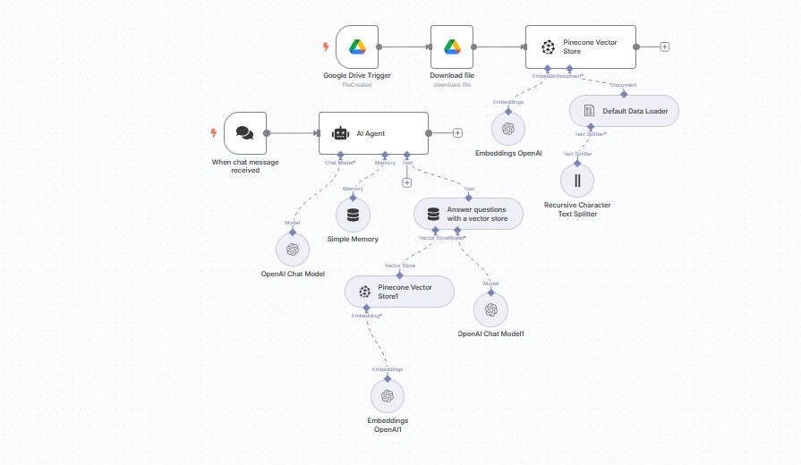

# 🤖 RAG Workflow using n8n + Google Drive + Pinecone + OpenAI

This repository contains an automated Retrieval-Augmented Generation (RAG) workflow built using [n8n](https://n8n.io/). It integrates **Google Drive**, **Pinecone**, and **OpenAI** to enable a chat-based system capable of retrieving answers from documents uploaded to Google Drive.



---

## 🔧 Workflow Features

- ✅ **Google Drive Integration**: Automatically watches for new files in a specific Drive folder.
- ✅ **Pinecone Vector Store**: Converts uploaded documents into embeddings and stores them for semantic search.
- ✅ **Text Splitting**: Uses recursive character splitting for better chunking and semantic retrieval.
- ✅ **OpenAI Integration**: Handles both embedding generation and answering queries with context-aware responses.
- ✅ **AI Agent (n8n)**: Acts as a central hub to process incoming messages, manage memory, and handle vector store queries.

---

## 🧠 Workflow Description

1. **File Upload Trigger**: When a new file is uploaded to a configured Google Drive folder.
2. **Download File**: The file is downloaded and passed to the workflow.
3. **Text Splitting**: File contents are split using recursive character text splitter.
4. **Embeddings Generation**: The text chunks are embedded using OpenAI’s Embedding API.
5. **Store in Pinecone**: Embeddings are pushed into a Pinecone vector store for later retrieval.
6. **Chat Interaction**: When a user sends a chat message:
    - The query is sent to the vector store.
    - Matching chunks are retrieved and passed to OpenAI Chat model.
    - The final answer is generated with contextual awareness from the stored data.

---

## 📁 Prerequisites

To use or deploy this workflow, make sure you have the following:

- ✅ [n8n](https://n8n.io/) instance running
- ✅ Google Drive API credentials
- ✅ Pinecone account and API key
- ✅ OpenAI API key

---

## 🚀 How to Deploy

1. **Clone this repo**
   ```bash
   git clone https://github.com/yourusername/rag-n8n-workflow.git
   cd rag-n8n-workflow
